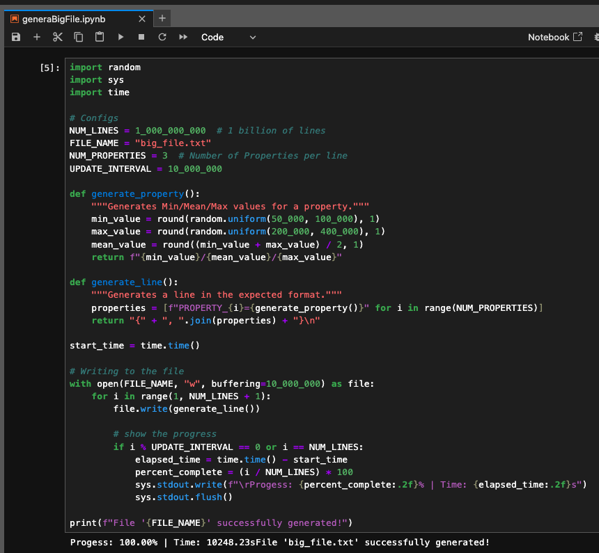

# One Billion Row Challenge

## What Is the One Billion Row Challenge?
The challenge is as simple as it is daunting:

You have a dataset containing 1,000,000,000 rows.
Each row includes:
A string identifier (e.g., PROPERTY_A)
A floating-point value (e.g., 123456.78)
You must compute the minimum, average, and maximum price for each unique property.

Example row:

```
PROPERTY_A;123456.78
``` 
By the end, you want a map (or any form of summary) that gives you something like:

```
{
PROPERTY_A=100000.0/175000.0/250000.0,
PROPERTY_B=95000.0/210500.4/399999.9,
...
}
```

The format is Min/Mean/Max for each identifier. 

## Goal: 
The real challenge is doing it fast. Let’s start with the most straightforward method: one thread, reading lines one by one.

# How to Generate the File

I created a script using Python as language on Jupyter, to simplify the process. I used only 3 properties for them.

## 1. Install Python
First, download and install Python (recommended version: Python 3.8 or later):

- Windows & macOS: Download from [python.org](https://www.python.org/downloads/)  and follow the installation steps.
- Linux (Debian/Ubuntu): Install via terminal:

```sh
sudo apt update && sudo apt install python3 python3-pip -y
## On Fedora:
sudo dnf install python3 python3-pip -y
```

## 2. Once Python is installed, 

- Open a terminal or command prompt and install Jupyter using pip:
```sh
pip install jupyter
```

## 3. Running Jupyter Notebook

- After installation, launch Jupyter Notebook by running:

```sh
jupyter notebook
```

## 4. Jupyter
- On the Jupyter you can Open file [generaBigFile.ipynb](GenerateFile/generaBigFile.ipynb), and execute this script.

```
Progess: 100.00% | Time: 4602.91s File 'big_file.txt' successfully generated!
```



# Running into the problem
## My Mac config:
- MacBook Pro 13", 2020 
- **Processor**: 2 GHz Quad-Core Intel Core i5
- **Memory**: 16 GB 3733 MHz LPDDR4X
- **OS**: macOS Sequoia Version 15.3.1

## Languages to solve the problem
- On [Java](java/README.md)